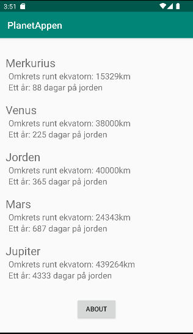
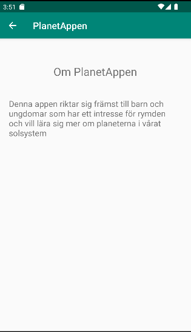

# Rapport

Jag började med att lägga till en RecyclerView i layout filen för MainActivity samt en knapp
som ska gå till appens about-sida.

Kodexempel 1
```
    <androidx.recyclerview.widget.RecyclerView
        android:id="@+id/planetRecycler_view"
        ...
    </androidx.recyclerview.widget.RecyclerView>

    <Button
        android:id="@+id/aboutbutton"
        ... />
```

Jag skapade sedan en ny layout fil som representerar de items som ska visas i RecyclerViewen
med 3 textviews.

Kodexempel 2
```
<LinearLayout xmlns:android="http://schemas.android.com/apk/res/android"
    android:layout_width="match_parent"
    android:layout_height="wrap_content"
    android:orientation="vertical"
    android:padding="10dp">

    <TextView
        android:id="@+id/planetName"
        ...

    <TextView
        android:id="@+id/planetCircumference"
        ...

    <TextView
        android:id="@+id/planetYear"
        ...

</LinearLayout>
```

Sen skapade jag en ny Java class med namnet Planet där jag genererade constructors,getters,setters
för att hantera name, size och cost objekten från json-filen.

Kodexempel 3
```
@SuppressWarnings("WeakerAccess")
public class Planet {

    private String name;
    private int size;
    private int cost;


    public String getName() {
        return name;
    }

    public void setName(String name) {
        this.name = name;
    }

    public int getSize() {
        return size;
    }

    public void setSize(int size) {
        this.size = size;
    }

    public int getCost() {
        return cost;
    }

    public void setCost(int cost) {
        this.cost = cost;
    }

    public Planet(String name, int size, int cost) {
        this.name = name;
        this.size = size;
        this.cost = cost;
    }
```

Sedam skapades en RecyclerViewAdapter som hanterar utskrivningen av data till RecyclerViewen.

Kodexempel 4
```
...
    @NonNull
    @Override
    public RecyclerViewAdapter.ViewHolder onCreateViewHolder(@NonNull ViewGroup parent, int viewType) {
        return new ViewHolder(layoutInflater.inflate(R.layout.recyclerview_item, parent, false));
    }

    @Override
    public void onBindViewHolder(@NonNull RecyclerViewAdapter.ViewHolder holder, int position) {
        holder.planetName.setText(planets.get(position).getName());
        holder.planetCircumference.setText("Omkrets runt ekvatorn: "+ planets.get(position).getSize() +"km");
        holder.planetYear.setText("Ett år: "+ planets.get(position).getCost() +" dagar på jorden");

    }

    @Override
    public int getItemCount() {
        return planets.size();
    }

    public class ViewHolder extends RecyclerView.ViewHolder implements View.OnClickListener {
        TextView planetName;
        TextView planetCircumference;
        TextView planetYear;

        ViewHolder(View itemView) {
            super(itemView);
            itemView.setOnClickListener(this);
            planetName = itemView.findViewById(R.id.planetName);
            planetCircumference = itemView.findViewById(R.id.planetCircumference);
            planetYear = itemView.findViewById(R.id.planetYear);
        }
        ...
```

Sen initierades adaptern i MainActivity.

Kodexempel 5
```
        adapter = new RecyclerViewAdapter(this, planets, new RecyclerViewAdapter.OnClickListener() {
            @Override
            public void onClick(Planet item) {
                Toast.makeText(MainActivity.this, item.getName(), Toast.LENGTH_SHORT).show();
            }
        });
        view.setLayoutManager(new LinearLayoutManager(this));
        view.setAdapter(adapter);
```

Json datan som jag hade skapat hämtade jag från json-api tjänsten och parsade den med gson till
min arraylist planets och notifierade adaptern att datan hade uppdaterats.

Kodexempel 6
```
Gson gson = new Gson();
        Type type = new TypeToken<List<Planet>>() {}.getType();
        planets = gson.fromJson(json, type);
        ...
        adapter.notifyDataSetChanged();

```

Jag länkade sedan knappen från startsidan till appens about-sida så att det är
möjligt att navigera till about-sidan

Kodexempel 7
```
Button aboutButton = findViewById(R.id.aboutbutton);
        aboutButton.setOnClickListener(new View.OnClickListener() {
            @Override
            public void onClick(View view) {
                Intent intent = new Intent(MainActivity.this, AboutActivity.class);
                startActivity(intent);
            }

```

Jag definierade sen i AndroidManifest filen att main_activity är about_activitys 
parent activity, vilket skapar en tillbaka-knapp i about activity så det är möjligt
att komma tillbaka till startsidan från about-sidan.

Kodexempel 8
```
        <activity
            android:name=".AboutActivity"
            android:parentActivityName=".MainActivity"
            ...
```


Till sist uppdaterade jag layout-filen för about-sidan med lite kort information om appen.

Kodexempel 9
```
    <TextView
        android:id="@+id/titleTextView"
        .../>

    <TextView
        android:id="@+id/infoTextView"
        ...>

```




Figur 1 Appens startsida med recyclerview och knapp till about-sida



Figur 2 Appens about-sida med kort text om appen
